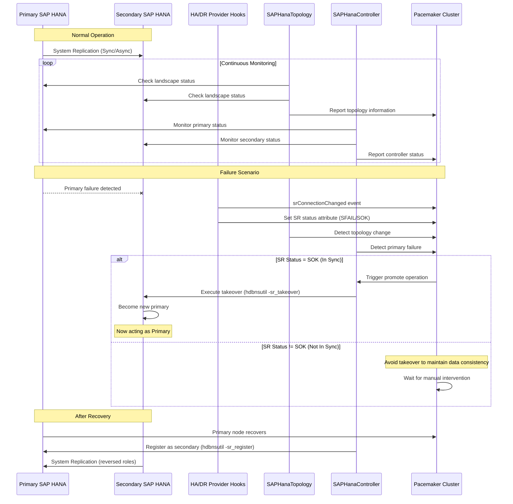
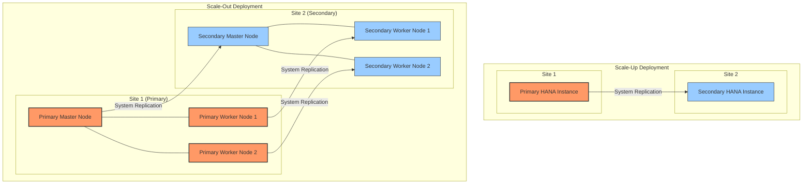

# SAPHanaSR-angi Architecture Diagrams

## 1. Component Architecture

Below is a Mermaid diagram representing the architecture and components of the SAPHanaSR-angi codebase:

```mermaid
graph TB
    %% Main Components
    subgraph "SAPHanaSR-angi"
        RA[Resource Agents]
        HOOKS[SAP HA/DR Hooks]
        TOOLS[Management Tools]
        TEST[Testing Framework]
        CONFIG[Cluster Configuration]
    end

    %% Resource Agents
    subgraph "Resource Agents"
        RA --> TOPO[SAPHanaTopology]
        RA --> CTRL[SAPHanaController]
        RA --> FS[SAPHanaFilesystem]
        
        subgraph "Libraries"
            COMMON[saphana-common-lib]
            TOPO_LIB[saphana-topology-lib]
            CTRL_LIB[saphana-controller-lib]
            CTRL_COMMON[saphana-controller-common-lib]
            FS_LIB[saphana-filesystem-lib]
        end
        
        TOPO --> COMMON
        TOPO --> TOPO_LIB
        CTRL --> COMMON
        CTRL --> CTRL_LIB
        CTRL --> CTRL_COMMON
        FS --> COMMON
        FS --> FS_LIB
        FS --> CTRL_COMMON
    end

    %% SAP HA/DR Hooks
    subgraph "SAP HA/DR Provider Hooks"
        HOOKS --> SUSCHK[susChkSrv.py]
        HOOKS --> SUSCOST[susCostOpt.py]
        HOOKS --> SUSHANSR[susHanaSR.py]
        HOOKS --> SUSTKOVER[susTkOver.py]
        HOOKS --> SUSMULTI[susHanaSrMultiTarget.py]
    end

    %% Management Tools
    subgraph "Management Tools"
        TOOLS --> SHOWATTR[SAPHanaSR-showAttr]
        TOOLS --> MONITOR[SAPHanaSR-monitor]
        TOOLS --> REPLAY[SAPHanaSR-replay-archive]
        TOOLS --> HELPER[SAPHanaSR-hookHelper]
        TOOLS --> PROVIDER[SAPHanaSR-manageProvider]
        TOOLS --> UPGRADE[SAPHanaSR-upgrade-to-angi-demo]
        
        SHOWATTR --> PYTOOLS[saphana_sr_tools.py]
    end

    %% Testing Framework
    subgraph "Testing Framework"
        TEST --> TESTBIN[Test Binaries]
        TEST --> TESTJSON[Test JSON Configs]
        TEST --> TESTWWW[Test Web Interface]
    end

    %% Cluster Configuration
    subgraph "Cluster Configuration"
        CONFIG --> SCALEUP[Scale-Up Configuration]
        CONFIG --> SCALEOUT[Scale-Out Configuration]
    end

    %% External Components
    SAP[SAP HANA Database]
    PACEMAKER[Pacemaker Cluster]
    
    %% Interactions
    SAP <--> HOOKS
    TOPO <--> SAP
    CTRL <--> SAP
    FS <--> SAP
    TOPO <--> PACEMAKER
    CTRL <--> PACEMAKER
    FS <--> PACEMAKER
    TOOLS <--> PACEMAKER
    HOOKS <--> PACEMAKER
    
    %% Legend
    classDef core fill:#f96,stroke:#333,stroke-width:2px
    classDef library fill:#9cf,stroke:#333,stroke-width:1px
    classDef external fill:#fcf,stroke:#333,stroke-width:2px
    
    class TOPO,CTRL,FS core
    class COMMON,TOPO_LIB,CTRL_LIB,CTRL_COMMON,FS_LIB library
    class SAP,PACEMAKER external
```

## 2. System Replication and Failover Workflow

This diagram illustrates the sequence of events during normal operation and failover scenarios:

## 3. Scale-Up vs Scale-Out Deployment Scenarios

## Component Descriptions

### Resource Agents
- **SAPHanaTopology**: Analyzes SAP HANA database topology and reports to the cluster
- **SAPHanaController**: Manages SAP HANA databases in System Replication, controls start/stop and monitors status
- **SAPHanaFilesystem**: Manages filesystem resources for SAP HANA

### SAP HA/DR Provider Hooks
- **susHanaSR.py**: Informs cluster about System Replication state changes
- **susChkSrv.py**: Checks server availability
- **susCostOpt.py**: Optimizes costs in the SAP HANA environment
- **susTkOver.py**: Handles takeover operations
- **susHanaSrMultiTarget.py**: Handles multi-target replication scenarios

### Management Tools
- **SAPHanaSR-showAttr**: Displays cluster attributes and status
- **SAPHanaSR-monitor**: Monitors the SAP HANA SR cluster
- **SAPHanaSR-replay-archive**: Replays archived cluster data
- **SAPHanaSR-hookHelper**: Assists with hook operations
- **SAPHanaSR-manageProvider**: Manages HA/DR providers
- **saphana_sr_tools.py**: Python library for SAP HANA SR tools

### Testing Framework
- Contains various test scripts and configurations for validating cluster behavior

### Cluster Configuration
- Contains example configurations for Scale-Up and Scale-Out scenarios

## Deployment Scenarios

### Scale-Up Deployment
- Single HANA instance per site
- Simpler configuration and management
- Suitable for smaller deployments
- Resource agents manage failover between the two instances

### Scale-Out Deployment
- Multiple HANA instances per site (master + worker nodes)
- Higher performance and capacity
- More complex configuration
- Resource agents manage both the node-level and site-level failover
- Requires coordination between multiple nodes during failover

## Workflow Summary

1. **SAPHanaTopology** monitors the SAP HANA landscape and reports to the cluster
2. **SAPHanaController** manages the SAP HANA databases based on topology information
3. **SAP HA/DR Hooks** communicate system replication state changes to the cluster
4. **Management Tools** provide visibility and control over the cluster state
5. During failover, the cluster orchestrates takeover operations between primary and secondary sites

This architecture enables high availability for SAP HANA databases using SUSE's cluster technology, supporting both Scale-Up and Scale-Out deployment scenarios.
